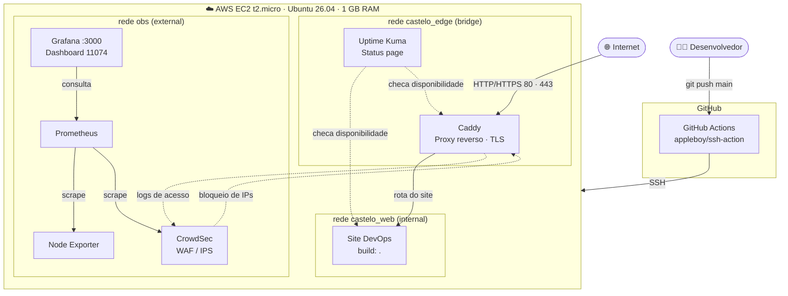
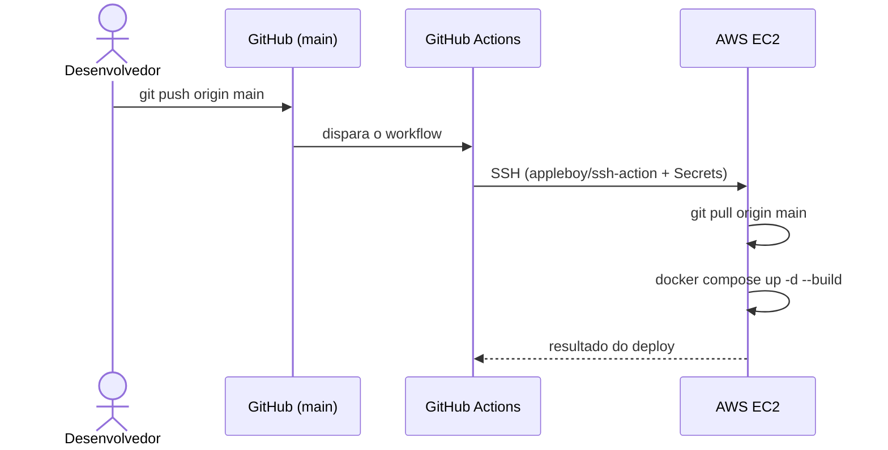

# 🏰 Projeto Devops — Infraestrutura DevOps na AWS

> Infraestrutura self-hosted em uma única instância **AWS EC2 (`t2.micro`)** que entrega um site DevOps com borda protegida (TLS + WAF), observabilidade completa de métricas, monitoramento de disponibilidade e **deploy automatizado via GitHub Actions**. Tudo orquestrado com Docker Compose, rodando dentro do limite de **1 GB de RAM** do Free Tier.


---

## 📋 Informações

| Item                  | Valor                                                        |
| --------------------- | ------------------------------------------------------------ |
| Alunos responsáveis   | Carlos Vitor Camara Gomes e Giovanna Secundo Penso           |
| Instituição           | Centro Universitário Faculdade São Lucas                     |
| Disciplina            | Cloud Computing                                              |
| Avaliação             | N1                                                           |
| Nuvem                 | AWS EC2 — instância `t2.micro` (Free Tier)                   |
| Sistema operacional   | Ubuntu 26.04 LTS                                             |
| Recursos da instância | 1 vCPU · **1 GB de RAM**                                     |
| Orquestração          | Docker + Docker Compose (arquivo `docker-compose.yml` único) |
| Repositório           | https://github.com/Buzzidd/projeto-devops                    |
| Site público          | 18.191.162.150                                               |
| Grafana               | 18.191.162.150:3000                                          |

### 👥 Integrantes

- Carlos Vitor Camara Gomes
- Giovanna Secundo Penso
- Joaquim Camillo Pereira Neto
- Lucas Gabriel Barreto Oliveira
- Ricardo Amorin Machado Junior
- Carlos Eduardo Passos Silva
- Agnaldo Santos Silva Júnior
- Eduardo Micael Saraiva Maia
- Artur Oliveira Ximenes De Almeida
- Guilherme Cavalcante Bandeira

---

## 📑 Índice

1. [Sobre o projeto](#-1-sobre-o-projeto)
2. [Arquitetura](#-2-arquitetura)
3. [Tecnologias](#-3-tecnologias)
4. [Redes do Docker](#-4-redes-do-docker)
5. [Borda e Segurança](#-5-borda-e-segurança-caddy--crowdsec)
6. [Observabilidade e Disponibilidade](#-6-observabilidade-e-disponibilidade)
7. [CI/CD: Deploy Automatizado](#-7-cicd-deploy-automatizado)
8. [Como subir a infraestrutura](#-8-como-subir-a-infraestrutura)
9. [Limitações e Desafios](#-9-limitações-e-desafios)

---

## 🎯 1. Sobre o projeto

O **Castelo** é a infraestrutura que hospeda e protege uma aplicação web DevOps. O objetivo da N1 foi montar, em uma única máquina da AWS, um ambiente que se aproxima de um cenário real de produção:

- **Borda segura:** todo o tráfego entra pelo Caddy (portas 80/443), com HTTPS automático e proteção ativa contra IPs maliciosos via CrowdSec.
- **Observabilidade:** métricas de CPU, RAM e disco do host coletadas pelo Prometheus e exibidas no Grafana.
- **Disponibilidade:** Uptime Kuma monitora os serviços e publica uma status page.
- **Entrega contínua:** a cada push na branch `main`, o GitHub Actions faz o deploy no servidor via SSH.
- **Isolamento de rede:** três redes Docker segmentam o que é interno, o que é borda e o que é observabilidade.

Tudo isso roda sob uma restrição proposital e desafiadora: **apenas 1 GB de RAM**. Essa limitação gerou o principal aprendizado do projeto (ver [seção 9](#-9-limitações-e-desafios)).

---

## 🏗️ 2. Arquitetura



**Fluxo em uma frase:** o tráfego entra pelo Caddy, que consulta o CrowdSec para barrar IPs maliciosos e roteia para o site; em paralelo, o Node Exporter expõe as métricas do host ao Prometheus, o Grafana as exibe em dashboards e o Uptime Kuma monitora a disponibilidade; a cada `git push`, o GitHub Actions atualiza tudo por SSH.

---

## 🧰 3. Tecnologias

| Camada                | Ferramenta                                 | Função                                                                |
| --------------------- | ------------------------------------------ | --------------------------------------------------------------------- |
| Nuvem                 | **AWS EC2** (`t2.micro`)                   | Servidor virtual no Free Tier (1 vCPU, 1 GB RAM)                      |
| Sistema operacional   | **Ubuntu 26.04 LTS**                       | Base do host                                                          |
| Containers            | **Docker + Docker Compose**                | Empacotamento e orquestração em um único `docker-compose.yml`         |
| Borda / proxy reverso | **Caddy**                                  | Roteamento, TLS automático e recebimento do tráfego nas portas 80/443 |
| WAF / IPS             | **CrowdSec**                               | Lê os logs do Caddy e bloqueia ataques e IPs maliciosos               |
| Coleta de métricas    | **Prometheus**                             | Armazena e consulta as métricas da máquina                            |
| Métricas do host      | **Node Exporter**                          | Extrai CPU, RAM e disco do host Ubuntu                                |
| Dashboards            | **Grafana** (porta `3000`)                 | Visualização com o dashboard comunitário **ID `11074`**               |
| Disponibilidade       | **Uptime Kuma**                            | Monitoramento de uptime e status page                                 |
| Aplicação             | **Site DevOps**                            | Aplicação web construída localmente (`build: .`)                      |
| CI/CD                 | **GitHub Actions** + `appleboy/ssh-action` | Deploy automatizado via SSH                                           |

---

## 🔌 4. Redes do Docker

A segmentação de rede é um dos pilares do projeto: cada serviço só enxerga quem precisa enxergar.

| Rede           | Tipo       | Quem participa                                       | Propósito                                                                                    |
| -------------- | ---------- | ---------------------------------------------------- | -------------------------------------------------------------------------------------------- |
| `castelo_web`  | `internal` | Site, backend (se houver), Caddy e Uptime Kuma       | Rede **isolada**: sem rota para a internet. Aqui trafega a comunicação da aplicação.         |
| `castelo_edge` | `bridge`   | Caddy e Uptime Kuma                                  | Camada de **borda**: o ponto de contato com o mundo externo.                                 |
| `obs`          | `external` | Caddy, CrowdSec, Prometheus, Grafana e Node Exporter | Rede **dedicada à observabilidade**. É externa para poder ser compartilhada entre as stacks. |

**Por que isso importa?**

- O site fica em uma rede `internal`, então não consegue sair para a internet nem ser acessado diretamente de fora — só pelo Caddy.
- O Caddy é o **único ponto de entrada** (portas 80/443 publicadas).
- A rede `obs` permite que o CrowdSec leia os logs do Caddy e que o Prometheus/Grafana conversem sem misturar esse tráfego com o da aplicação.

---

## 🛡️ 5. Borda e Segurança (Caddy + CrowdSec)

### 🚪 Caddy — a porta de entrada

O Caddy atua como **proxy reverso e roteador de borda**, recebendo todo o tráfego nas portas **80 e 443** e encaminhando para o serviço correto dentro da rede interna. Entre as vantagens: configuração simples (`Caddyfile`), HTTPS automático com certificados gerenciados por ele e logs de acesso estruturados, que alimentam o CrowdSec.

### 🧱 CrowdSec — WAF / IPS

O CrowdSec funciona em dois tempos:

1. **Detecção:** lê os logs de acesso do Caddy e avalia o comportamento das requisições (varreduras, força bruta, exploração de vulnerabilidades conhecidas).
2. **Bloqueio:** IPs identificados como maliciosos são barrados na borda, antes de chegarem à aplicação.

### 🔒 Boas práticas de hardening

- Rede da aplicação **interna**, sem acesso externo direto.
- Apenas o Caddy publica as portas 80/443 para a internet.
- Segredos fora do repositório (chaves SSH e variáveis sensíveis em **GitHub Secrets** / arquivo `.env` ignorado no git).
- Política de reinício dos containers (`restart: always` / `unless-stopped`) para auto-recuperação.

---

## 📊 6. Observabilidade e Disponibilidade

### 📈 Métricas: Node Exporter → Prometheus → Grafana

| Componente            | Papel                                                                    |
| --------------------- | ------------------------------------------------------------------------ |
| **Node Exporter**     | Agente que extrai CPU, RAM e disco do host Ubuntu                        |
| **Prometheus**        | Faz o _scrape_ periódico do Node Exporter e armazena as séries temporais |
| **Grafana** (`:3000`) | Consome o Prometheus como _datasource_ e exibe os dados                  |

Para a visualização, usamos o **dashboard comunitário ID `11074`** (Node Exporter for Prometheus Dashboard), que entrega painéis prontos de CPU, memória, disco e rede — exatamente o que precisávamos para enxergar o comportamento da máquina durante o incidente de falta de RAM.

> 💡 **Como importar:** no Grafana, vá em _Dashboards → New → Import_, informe o ID `11074` e selecione o datasource do Prometheus.

### ✅ Disponibilidade: Uptime Kuma

O **Uptime Kuma** monitora a disponibilidade dos serviços (site, Caddy etc.), registra o histórico de uptime, permite alertas de queda e publica uma **status page**. Ele participa das redes `castelo_web` e `castelo_edge` para alcançar os alvos internos e ser servido pelo Caddy.

---

## 🚀 7. CI/CD: Deploy Automatizado

O deploy é feito com **GitHub Actions**, disparado a cada push na branch `main`. A pipeline se conecta ao servidor por **SSH** usando a action [`appleboy/ssh-action`](https://github.com/appleboy/ssh-action) e executa os comandos de atualização diretamente na instância EC2.

### 🔐 Secrets utilizados

Configurados em _Settings → Secrets and variables → Actions_:

| Secret     | Conteúdo                                |
| ---------- | --------------------------------------- |
| `HOST`     | IP público (ou DNS) da instância EC2    |
| `USERNAME` | Usuário SSH do servidor (ex.: `ubuntu`) |
| `KEY`      | Chave privada SSH usada na autenticação |
| `PORT`     | Porta SSH (padrão `22`)                 |

### 🔄 Fluxo da pipeline



### 📄 Exemplo de workflow (`.github/workflows/deploy.yml`)

name: Deploy

on:
push:
branches: [main]

jobs:
deploy:
runs-on: ubuntu-latest
steps: - name: Deploy via SSH
uses: appleboy/ssh-action@v1
with:
host: ${{ secrets.HOST }}
username: ${{ secrets.USERNAME }}
key: ${{ secrets.KEY }}
port: ${{ secrets.PORT }}
script: |
cd ~/projeto-devops
git pull origin main
docker compose up -d --build

````

> ⚠️ Ajuste `<pasta-do-projeto>` para o diretório onde o repositório foi clonado no servidor. Este é um exemplo ilustrativo — confira se bate com o seu workflow real.

---

## ▶️ 8. Como subir a infraestrutura

**Pré-requisitos**

- Instância EC2 com Ubuntu, Docker e Docker Compose instalados.
- Security Group liberando as portas `22` (SSH), `80`, `443` e, se necessário, `3000` (Grafana — preferencialmente restrita ao seu IP).
- Arquivo `.env` preenchido (quando aplicável), fora do versionamento.

```bash
# 1. Clonar o repositório no servidor
git clone https://github.com/Buzzidd/projeto-devops.git
cd projeto-devops

# 2. Criar a rede externa de observabilidade (uma única vez)
docker network create obs

# 3. Subir toda a infraestrutura
docker compose up -d --build

# 4. Verificar o estado dos containers
docker compose ps

# 5. Acompanhar o consumo de memória (importante em 1 GB de RAM!)
free -h
docker stats --no-stream
````

**Verificação rápida**

```bash
curl -I http://localhost          # resposta do Caddy / site
docker compose logs -f caddy      # logs de acesso
```

Depois de subir, acesse o **Grafana** em `18.191.162.150:3000`, adicione o Prometheus como datasource e importe o dashboard **`11074`**.

---

## ⚠️ 9. Limitações e Desafios

Esta seção documenta, sem filtro, o que deu errado e como foi tratado — a parte mais didática do projeto.

### 🧠 Gargalo de RAM

A `t2.micro` tem **apenas 1 GB de RAM**, e todos os serviços (Caddy, CrowdSec, Prometheus, Node Exporter, Grafana, Uptime Kuma e o site) rodam juntos nela. Em operação normal, o ambiente cabe — mas **sem folga**.

O problema apareceu no **CI/CD**: o comando `docker compose up -d --build` faz o _build_ da imagem e recria containers **enquanto toda a stack continua rodando**. O pico de memória gerado por essa combinação **esgotou totalmente a RAM** do servidor.

### 🧊 O congelamento

Com a memória esgotada, o servidor travou e parou de responder. Do lado do GitHub, a pipeline falhou com o erro:

```
DeadlineExceeded
```

ou seja, a action não conseguiu concluir a conexão/execução no prazo, pois a máquina estava congelada.

### 🛠️ Solução aplicada

1. **Reinício forçado (reboot)** da instância pelo console da AWS.
2. Graças às políticas **`restart: always`** e **`unless-stopped`** definidas no Compose, **toda a infraestrutura se recuperou sozinha** após o boot, sem intervenção manual nos containers.

> ✅ **Lição:** definir políticas de reinício não é detalhe — foi isso que transformou um travamento total em uma recuperação automática.

### 🔜 Próximo passo planejado: arquivo de SWAP

Para evitar novos travamentos causados pelo **OOM Killer** do Linux, o plano é criar um **arquivo de SWAP** no disco SSD da AWS, funcionando como memória de apoio durante picos (como o build do deploy).

```bash
# Exemplo de criação de 2 GB de swap
sudo fallocate -l 2G /swapfile
sudo chmod 600 /swapfile
sudo mkswap /swapfile
sudo swapon /swapfile

# Tornar permanente
echo '/swapfile none swap sw 0 0' | sudo tee -a /etc/fstab

# Conferir
free -h
```

> ⚠️ O swap é um **amortecedor**, não um substituto de RAM: por usar disco, é mais lento. Ele reduz o risco de travamento, mas não elimina o gargalo.

### 📌 Outras limitações conhecidas

- **Servidor único, sem alta disponibilidade:** se a instância cai, tudo cai — não há failover.
- **Build no próprio servidor:** compilar imagens na máquina de produção compete por RAM com os serviços em execução.
- **Segredos em arquivos `.env`:** adequado para o escopo da disciplina, mas sem cofre de segredos (Vault/SOPS).

### 🧭 Melhorias futuras sugeridas

- Criar o **swap** (próximo passo já planejado).
- Mover o **build para o GitHub Actions**, publicar a imagem em um registry (ex.: GHCR) e deixar o servidor apenas fazer `pull` — evitando o pico de memória na `t2.micro`.
- Definir **limites de memória** (`mem_limit`) por container para que um serviço não derrube os demais.
- Configurar **alertas** (Grafana/Alertmanager ou Uptime Kuma) para consumo alto de RAM e quedas de serviço.
- Avaliar uma instância maior (ex.: `t3.small`) caso o projeto evolua além do Free Tier.

---

<div align="center">

🏰 **Projeto Devops** · Cloud Computing · Centro Universitário Faculdade São Lucas

Desenvolvido por **Carlos Vitor Camara Gomes** & **Giovanna Secundo Penso** e equipe.

</div>
